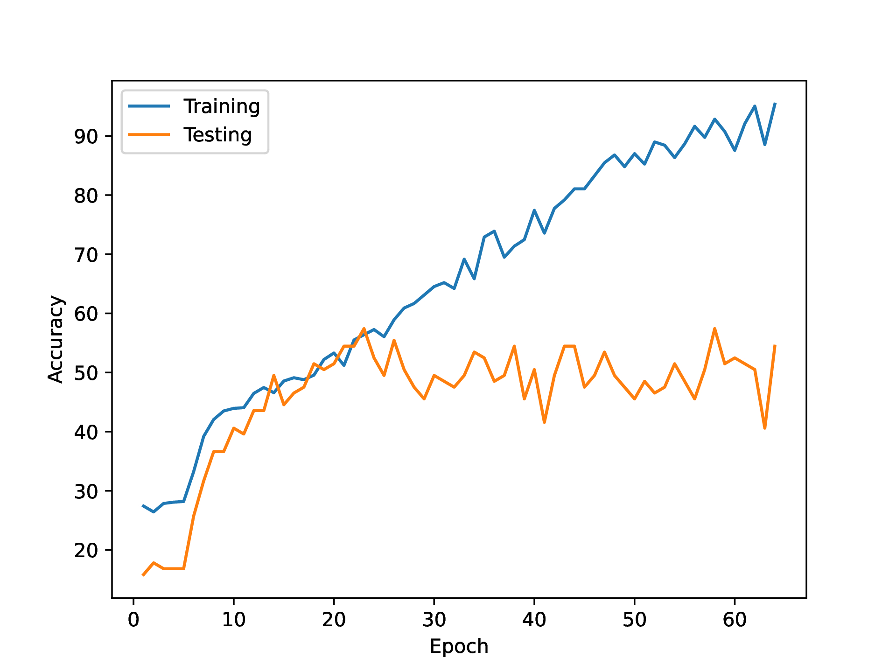
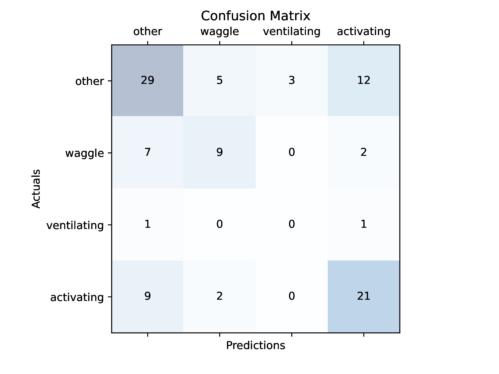
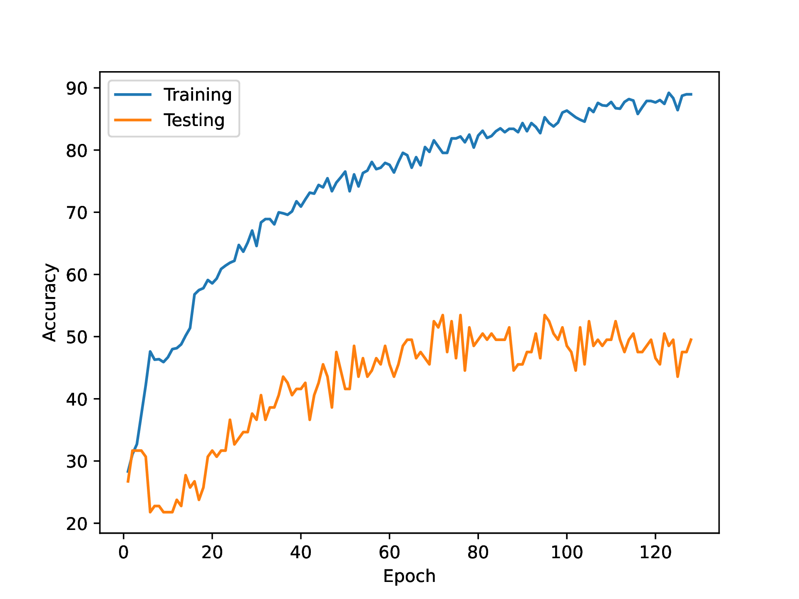
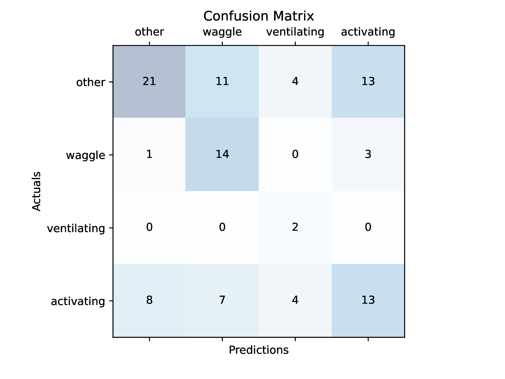
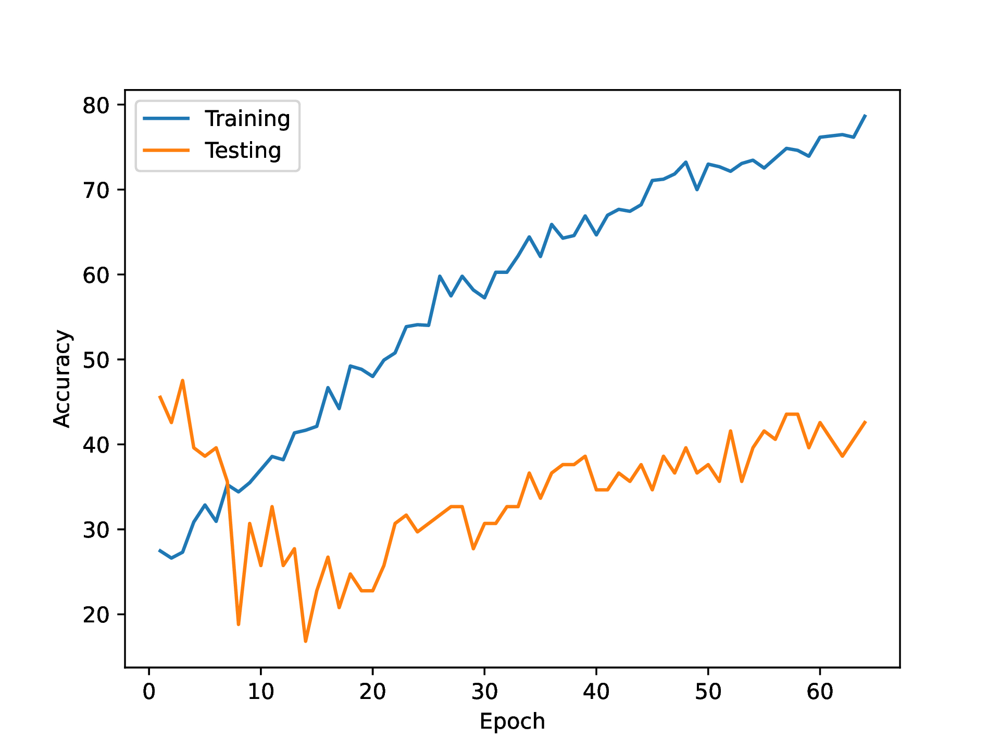
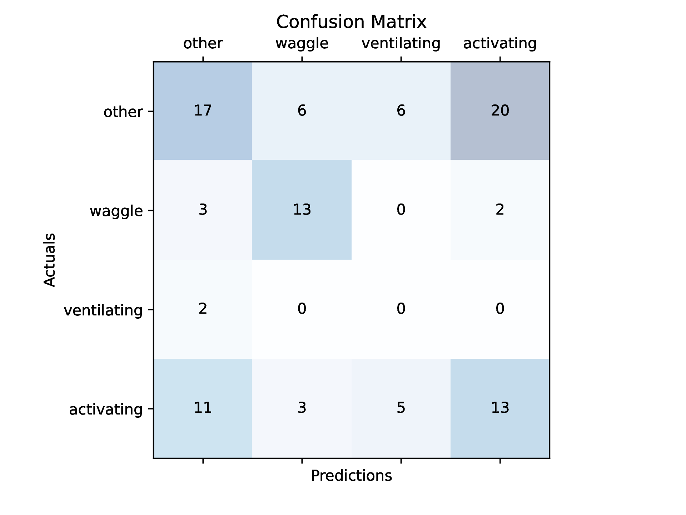
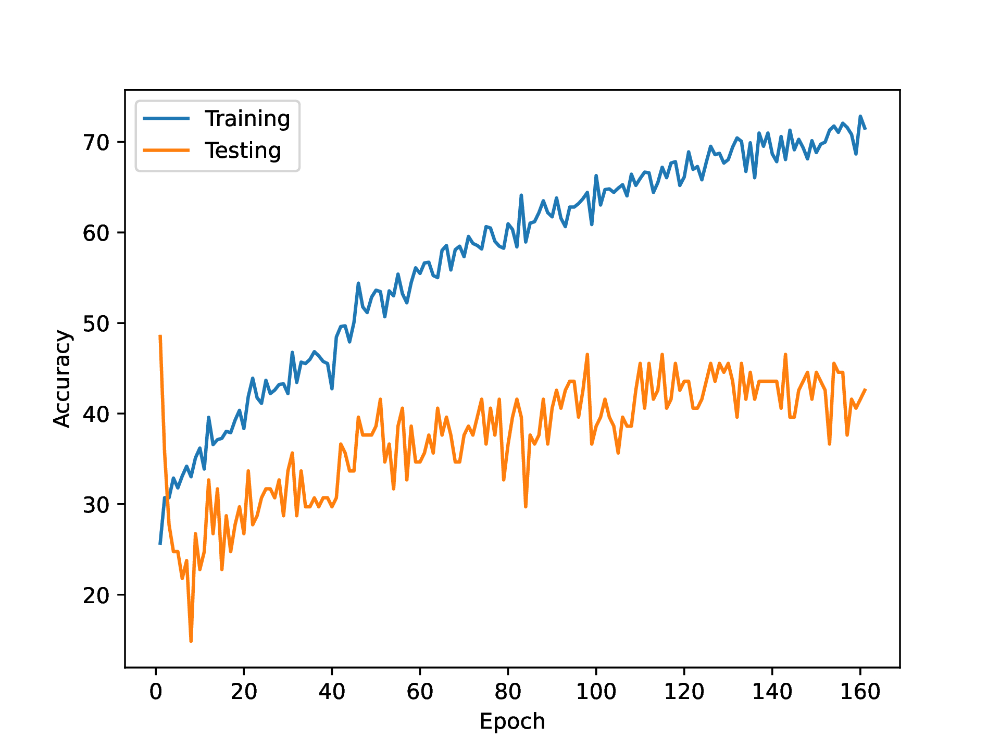
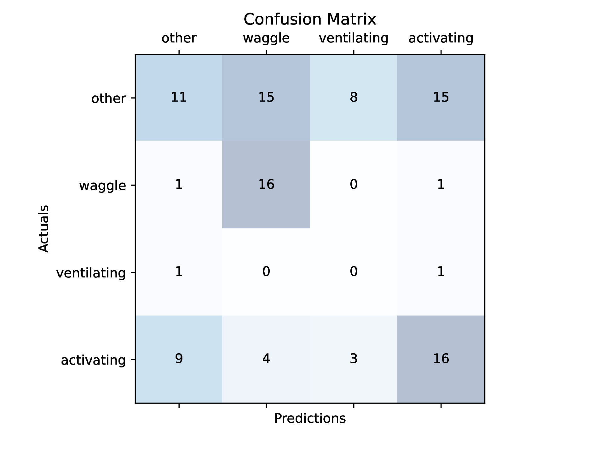

# SWP-2023-Automatic-Detection-of-Vibratory-Behavior-of-Honeybees

Model for classifying bee behavior based on a stack of video frames.

The evaluations of different model architectures are saved into the `stats_*` directories.
The contents of the `stats_*` directory are generated after training and show the test/training accuracies at each epoch,
mean loss at each epoch and confusion matrix from the trained model.

## Results

<table>
      <tr><td><b>Model</b></td><td>CNN (4 x Conv2d + BN + ReLU + MaxPool) + LSTM (1 x 128)</td></tr>
      <tr></tr>
      <tr><td><b>Optimizer</b></td><td>Adam, LR=1e-5</td></tr>
      <tr></tr>
      <tr><td><b>Criterion</b></td><td>Cross Entropy</td></tr>
      <tr></tr>
      <tr><td><b>Batch Size</b></td><td>16</td></tr>
      <tr></tr>
      <tr><td><b>Batch Sampler</b></td><td>None</td></tr>
      <tr></tr>
      <tr><td><b>Epochs</b></td><td>64</td></tr>
      <tr></tr>
      <tr><td><b>Image Augmentation</b></td><td>One of [Roation90, Rotation180, Rotation270, FlipHorizontal, FlipVertical]</td></tr>
      <tr></tr>
      <tr><td><b>Image Size</b></td><td>110 x 110</td></tr>
      <tr></tr>
      <tr><td><b>Image Normalization</b></td><td>Mean=0.5, Std=0.5 (Range=[-1,1])</td></tr>
      <tr></tr>
      <tr><td><b>Input Format</b></td><td>16 x L x 1 x 110 x 110 (No Padding / Trimming)</td></tr>
      <tr></tr>
      <tr><td><b>Output Format</b></td><td>16 x 4</td></tr>
</table>

**Comments**:

-   Textbook overfitting.
-   Categorical accuracy might not be a good measure of the models performance since the training data has an unequal class distribution which can skew the models predictions towards majority classes.
-   We avoid padding or trimming the videos in a batch by working with a pytorch `PackedSequence` object which can be passed to the LSTM. We first create a `PackedSequence` consisting of all video images in a batch and then feed those images to the CNN which produces image embeddings. We then replace the video images in the `PackedSequence` with the image embeddings. For this to work with the CNN we create a fake batch dimension with an inflated batch size of `sum_{i=0}^{batch_size} number of images in video i`. This creates issues with high memory consumption.

[Commit](https://github.com/linusb20/SWP-2023-Automatic-Detection-of-Vibratory-Behavior-of-Honeybees/tree/88d970d3a00ca256deca7df1c247fb15534aedfb)

---

<table>
      <tr><td><b>Model</b></td><td>Pretrained Resnet18 CNN + LSTM (1 x 128)</td></tr>
      <tr></tr>
      <tr><td><b>Optimizer</b></td><td>Adam, LR=1e-5</td></tr>
      <tr></tr>
      <tr><td><b>Criterion</b></td><td>Cross Entropy</td></tr>
      <tr></tr>
      <tr><td><b>Batch Size</b></td><td>8</td></tr>
      <tr></tr>
      <tr><td><b>Batch Sampler</b></td><td>Oversampling of minority classes for equal class distribution</td></tr>
      <tr></tr>
      <tr><td><b>Epochs</b></td><td>128</td></tr>
      <tr></tr>
      <tr><td><b>Image Augmentation</b></td><td>None</td></tr>
      <tr></tr>
      <tr><td><b>Image Size</b></td><td>224 x 224</td></tr>
      <tr></tr>
      <tr><td><b>Image Normalization</b></td><td>Mean=(0.485 + 0.456 + 0.406)/3, Std=(0.229 + 0.224 + 0.225)/3
      <tr></tr>
      <tr><td><b>Input Format</b></td><td>8 x L x 1 x 224 x 224 (No Padding / Trimming)</td></tr>
      <tr></tr>
      <tr><td><b>Output Format</b></td><td>8 x 4</td></tr>
</table>

**Comments**:

-   We use the convolutional layers of a Resnet18 model that has been pretrained on the `ImageNet` dataset for capturing general spatial properties of our video images. We fix the convolutional layers and add trainable fully connected layers on top. The goal is to have the model work with general spatial features and give it less capacity for overfitting.
-   The model is still very much focused on the training data. Using image augmenation might help to regularize the model.
-   We want to recreate the properties of the `ImageNet` dataset which consists of 224 x 224 RGB images. Unfortunately this also increases memory consumption during training especially due to the batch norm layers which have to work with an inflated batch size.

[Commit](https://github.com/linusb20/SWP-2023-Automatic-Detection-of-Vibratory-Behavior-of-Honeybees/tree/752247b39ea119aeb035c3890389d617235ddb0f)

---

<table>
      <tr><td><b>Model</b></td><td>CNN (4 x Conv2d + BN + ReLU + MaxPool) + LSTM (1 x 128)</td></tr>
      <tr></tr>
      <tr><td><b>Optimizer</b></td><td>Adam, LR=1e-5</td></tr>
      <tr></tr>
      <tr><td><b>Criterion</b></td><td>Cross Entropy</td></tr>
      <tr></tr>
      <tr><td><b>Batch Size</b></td><td>16</td></tr>
      <tr></tr>
      <tr><td><b>Batch Sampler</b></td><td>Oversampling of minority classes for equal class distribution</td></tr>
      <tr></tr>
      <tr><td><b>Epochs</b></td><td>64</td></tr>
      <tr></tr>
      <tr><td><b>Image Augmentation</b></td><td>Sequence of [Multiplicative Noise (p=0.75), GaussianNoise (p=0.75), GaussianBlur (p=0.75), RandomBrightnessContrast (p=0.75)] + Affine (Translation, Shear, Scale) (p=0.75)</td></tr>
      <tr></tr>
      <tr><td><b>Image Size</b></td><td>110 x 110</td></tr>
      <tr></tr>
      <tr><td><b>Image Normalization</b></td><td>Mean=0.5, Std=0.5, (Range=[-1,1]) 
      <tr></tr>
      <tr><td><b>Input Format</b></td><td>16 x L x 1 x 110 x 110 (No Padding / Trimming)</td></tr>
      <tr></tr>
      <tr><td><b>Output Format</b></td><td>16 x 4</td></tr>
</table>

**Comments**

-   Despite image augmentation the model still overfits to the training data. The problem may be with the high (p=0.75) probabilites given to the random image transformations which fails to create high variation in the training data.
-   The drop in testing accuracy at the beginning might be due to no image augmentation being applied to the test dataset. The model trains on augmented images from the beginning while the test data looks very different. It might be more efficient to start with little augmentation and increase during training.

[Commit](https://github.com/linusb20/SWP-2023-Automatic-Detection-of-Vibratory-Behavior-of-Honeybees/tree/1759dd9186f721af0180c30c0572f13b75b10826)

---

<table>
      <tr><td><b>Model</b></td><td>CNN (4 x Conv2d + BN + ReLU + MaxPool) + GRU (1 x 128)</td></tr>
      <tr></tr>
      <tr><td><b>Optimizer</b></td><td>Adam, LR=1e-5</td></tr>
      <tr></tr>
      <tr><td><b>Criterion</b></td><td>Cross Entropy</td></tr>
      <tr></tr>
      <tr><td><b>Batch Size</b></td><td>16</td></tr>
      <tr></tr>
      <tr><td><b>Batch Sampler</b></td><td>Oversampling of minority classes for equal class distribution</td></tr>
      <tr></tr>
      <tr><td><b>Epochs</b></td><td>64</td></tr>
      <tr></tr>
      <tr><td><b>Image Augmentation</b></td><td>Sequence of [Multiplicative Noise (p=0.5), GaussianNoise (p=0.25), GaussianBlur (p=0.55), RandomBrightnessContrast (p=0.6), RandomGamma (p=0.5)] + Sequence of [One of [HorizontalFlip, VerticalFlip] (p=0.8), RandomRotate90 (p=0.5), Affine (Translation, Shear, Scale) (p=0.5)] </td></tr>
      <tr></tr>
      <tr><td><b>Image Size</b></td><td>110 x 110</td></tr>
      <tr></tr>
      <tr><td><b>Image Normalization</b></td><td>Mean=0.5, Std=0.5, (Range=[-1,1]) 
      <tr></tr>
      <tr><td><b>Input Format</b></td><td>16 x L x 1 x 110 x 110 (No Padding / Trimming)</td></tr>
      <tr></tr>
      <tr><td><b>Output Format</b></td><td>16 x 4</td></tr>
</table>

**Comments**

-   We try to create more variation in the training data by applying more image augmentation with varying probabilites.
-   The accuracy of the model stagnates at some point while the training accuracy increases very slowly. It seems that the only way for the model to drive down the training loss is to struggle to learn the training data.
-   The confusion matrix shows that the model has a hard time distinguishing the "other" class from the three other classes. Solutions might be to penalize the model misclassifying the "other" class or to first perform a two-class classification task distinguishing between "other" and the three other classes and then perfrom a three-class classification task distinguishing between "ventilating", "activating" and "waggle".

[Commit](https://github.com/linusb20/SWP-2023-Automatic-Detection-of-Vibratory-Behavior-of-Honeybees/tree/4e0b5ba87022820b94f0fe583fee63be4e2fbc3c)

## TODO

-   [x] image augmenation (blur, contrast, crop, translation, stretching, padding)
-   [ ] pretrain CNN to produce good image embeddings
-   [x] write a custom batch sampler that samples training examples such that class labels are equally distributed ("other", "waggle", "ventilating", "activating" classes should have an equal chance of being sampled in a batch)
-   [x] save the state of the model and the state of the optimizer during training. See [here](https://pytorch.org/tutorials/beginner/saving_loading_models.html) for how to do this in pytorch
