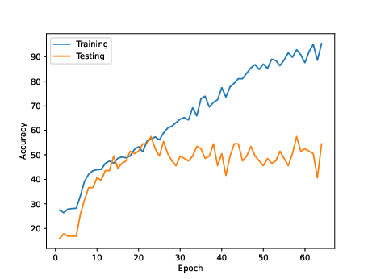

# SWP-2023-Automatic-Detection-of-Vibratory-Behavior-of-Honeybees

Model for classifying bee behavior based on a stack of video frames.

The evaluations of different model architectures are saved into the `stats_*` directories.
The contents of the `stats_*` directory are generated after training and show the test/training accuracies at each epoch,
mean loss at each epoch and confusion matrix from the trained model.

## Results

Model: CNN (4 x Conv2d + BN + ReLU + MaxPool) + LSTM (1 x 128)
Optimizer: Adam (lr=1e-5)
Criterion: Cross Entropy
Batch Size: 16
Batch Sampler: None
Epochs: 64
Image Augmentation: Random Roation / Flip on each image in video
Image Size: 110 x 110
Image Normalization: Mean=0.5, Std=0.5 (Range=[-1,1])

## TODO

-   [x] image augmenation (blur, contrast, crop, translation, stretching, padding)
-   [ ] pretrain CNN to produce good image embeddings
-   [x] write a custom batch sampler that samples training examples such that class labels are equally distributed ("other", "waggle", "ventilating", "activating" classes should have an equal chance of being sampled in a batch)
-   [x] save the state of the model and the state of the optimizer during training. See [here](https://pytorch.org/tutorials/beginner/saving_loading_models.html) for how to do this in pytorch
